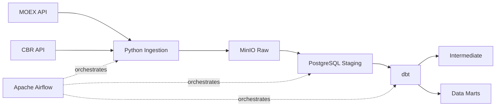
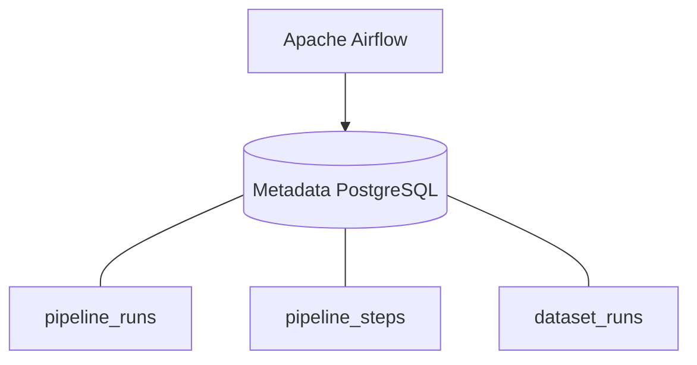

# Financial Data Platform

End-to-end Data Engineering pet project for collecting and transforming CBR key rate and MOEX RGBI market data.

## Stack

Python, Apache Airflow, PostgreSQL, MinIO/S3, dbt, Docker Compose.

## Key design decisions

- Raw source responses are stored unchanged in MinIO.
- Staging preserves source values as text.
- Type conversion and business transformations are handled by dbt.
- Airflow is responsible only for orchestration.
- Dataset state is stored separately from pipeline execution state.
- Incremental ingestion uses metadata-driven watermarks.
- Dataset load identifiers provide lineage between raw data, staging, and transformed data.

###	Idempotency

Each dataset load has a unique run_id. Raw objects and staging records are associated with this identifier, allowing a failed load to be safely retried without affecting previous runs.

### Incremental processing

Next API request start date is derived from the last successfully processed dataset watermark stored in metadata.

For a new dataset:

`requested_start = 2014-01-01`

For subsequent runs:

`requested_start = last_successful_actual_max_date + 1 day`

### Metadata

Each pipeline run, pipeline step, and dataset load can be uniquely identified. The metadata also provides end-to-end lineage from raw data ingestion to transformed data marts.

### Data lineage

Each dataset load is identified by a unique `dataset_run_id`, which is propagated through the pipeline:

`dataset_runs.id → MinIO raw objects → staging.run_id → int.source_run_id`

This allows a transformed record to be traced back to its original raw ingestion.

## Architecture



## Metadata design



### `metadata.pipeline_runs`

Tracks the lifecycle of a complete pipeline execution.

| Column | Description |
|---|---|
| `id` | Pipeline run identifier |
| `pipeline_name` | Pipeline name |
| `started_at` | Start timestamp |
| `finished_at` | Completion timestamp |
| `status` | `running`, `success`, `error` |
| `error` | Error message, if any |

### `metadata.pipeline_steps`

Tracks execution status and metrics of individual pipeline steps.

| Column | Description |
|---|---|
| `id` | Pipeline step identifier |
| `pipeline_run_id` | Pipeline run identifier |
| `step_name` | Pipeline step name |
| `step_type` | Pipeline step type - `ingestion`, `staging`, `transformation` |
| `started_at` | Start timestamp |
| `finished_at` | Completion timestamp |
| `status` | `running`, `success`, `error` |
| `records_in` | Records in, if any |
| `records_out` | Records out, if any |
| `error` | Error message, if any |

### `metadata.dataset_runs`

Tracks state of a specific dataset load, including incremental watermark.

| Column | Description |
|---|---|
| `id` | Dataset run identifier |
| `pipeline_run_id` | Pipeline run identifier |
| `dataset` | Dataset name |
| `requested_start` | Requested start of source data |
| `actual_max_date` | Maximum date successfully processed by the transformation layer |
| `records_loaded` | Records loaded count |
| `status` | `running`, `success`, `error` |
| `minio_bucket` | MinIO bucket with raw responses |
| `minio_prefix` | MinIO prefix with raw responses |
| `objects_saved` | Number of loaded raw objects |

## Project structure

```text
.
├── airflow
│   └── dags
├── dbt
├── docker-compose.yml
├── Dockerfile
├── pyproject.toml
├── README.md
└── src
    └── financial_data
        ├── config.py
        ├── ingestion.py
        ├── metadata_repo.py
        ├── sources.py
        ├── staging.py
        ├── storage.py
        └── transformation.py
```

## Airflow Connections

The DAG uses the following Airflow Connections:

| Connection ID | Type | Purpose |
|---|---|---|
| `financial_postgres` | PostgreSQL | Project PostgreSQL database |
| `financial_minio` | Generic / AWS | MinIO object storage |

Connections are created in the Airflow UI under:

**Admin → Connections**

Credentials are intentionally not stored in the repository.

## How to run

```bash
git clone <repository-url>
cd financial-data-platform

cp .env.example .env

docker compose up -d
```

Open the Airflow UI and create the following connections:

| Connection ID        | Type          | Purpose                     |
| -------------------- | ------------- | --------------------------- |
| `financial_postgres` | PostgreSQL    | Project PostgreSQL database |
| `financial_minio`    | Generic / AWS | MinIO object storage        |

Then trigger the financial_data DAG.