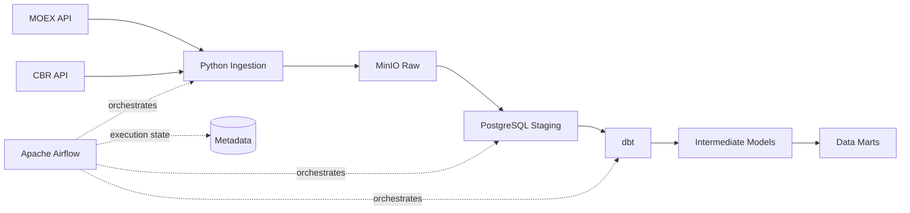
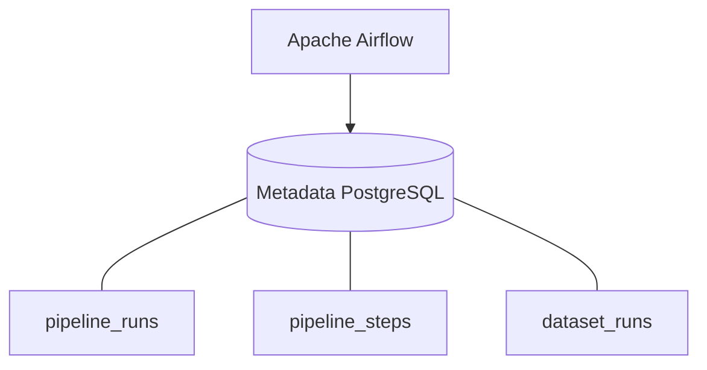

# Financial Data Platform

End-to-end Data Engineering pet project for collecting, storing, transforming and analyzing CBR key rate and MOEX RGBI market data.

The project demonstrates a production-oriented batch data pipeline with incremental ingestion, raw data preservation, metadata-driven processing, data lineage, dbt transformations, orchestration with Airflow, automated testing and Docker-based infrastructure.

## Architecture


```mermaid
flowchart LR
    MOEX[MOEX API] --> INGEST[Python Ingestion]
    CBR[CBR API] --> INGEST

    INGEST --> RAW[MinIO Raw]
    RAW --> STG[PostgreSQL Staging]
    STG --> DBT[dbt]

    DBT --> INT[Intermediate Models]
    INT --> MARTS[Data Marts]

    AF[Apache Airflow] -. orchestrates .-> INGEST
    AF -. orchestrates .-> STG
    AF -. orchestrates .-> DBT

    AF -. execution state .-> META[(Metadata)]
```

## Stack

* Python
* Apache Airflow
* PostgreSQL
* MinIO/S3
* dbt
* Docker Compose
* pytest
* Ruff
* mypy
* GitHub Actions

## What this project demonstrates

* Batch ingestion from external APIs
* Incremental data loading
* Raw data preservation
* Metadata-driven watermarks
* Idempotent staging
* Separation of pipeline and dataset state
* End-to-end data lineage
* dbt-based transformations
* Airflow orchestration
* Unit, integration and end-to-end testing
* Docker-based local infrastructure
* CI validation of both application code and runtime infrastructure

## Data flow

1. Airflow creates a pipeline run and dataset runs for the required datasets
2. Metadata determines the requested source start date using the last successfully processed watermark
3. Python ingestion retrieves data from the MOEX and CBR APIs
4. Raw HTTP responses are stored unchanged in MinIO
5. Staging loaders parse the raw responses and load source values into PostgreSQL staging tables
6. dbt transforms source values into typed intermediate models and data marts
7. The actual maximum successfully processed date is determined from the typed intermediate layer
8. Dataset watermarks and pipeline execution state are finalized in metadata

## Key design decisions

### Raw data preservation

Raw API responses are stored unchanged in MinIO.

This keeps the original source representation available for debugging, reprocessing and future transformation changes without requesting the source API again.

### Staging layer

The PostgreSQL staging layer preserves source values as text.

Parsing and loading are separated from business transformations, while source-level values remain close to their original representation.

### Transformation layer

Type conversion, gap filling and business transformations are handled by dbt.

This keeps Python ingestion focused on data acquisition and Airflow focused on orchestration.

### Separation of responsibilities

The pipeline separates three responsibilities:

* **Python** - source access, raw ingestion and staging
* **dbt** - type conversion and transformations
* **Airflow** - orchestration and pipeline execution

This prevents the orchestration layer from containing dataset-specific transformation logic.

## Incremental processing

Incremental ingestion uses metadata-driven watermarks.

For a new dataset:

```text
requested_start = 2014-01-01
```

For subsequent runs:

```text
requested_start = last_successful_actual_max_date + 1 day
```

The watermark is based on the maximum date successfully processed by the transformation layer rather than simply the date requested from the source API.

This ensures that the next incremental load starts from data that was actually processed successfully.

## Idempotency

Each dataset load has unique `dataset_run_id`.

Raw objects and staging records are associated with this identifier. A retry therefore uses a separate dataset run and does not overwrite data belonging to previous successful runs.

Staging loaders also remove records belonging to the current run before inserting them, making repeated execution of the same staging step idempotent.

## Metadata and pipeline step

Pipeline execution state and dataset load state are stored separately.


```mermaid
flowchart TB
    AF[Apache Airflow] --> META[(Metadata PostgreSQL)]

    META --- PR[pipeline_runs]
    META --- PS[pipeline_steps]
    META --- DR[dataset_runs]
```

### `metadata.pipeline_runs`

Tracks the lifecycle of a complete pipeline execution.

| Column | Description |
|---|---|
| `id` | Pipeline run identifier |
| `pipeline_name` | Pipeline name |
| `started_at` | Start timestamp |
| `finished_at` | Completion timestamp |
| `status` | `running`, `success`, `error` |
| `error` | Error message, if any |

### `metadata.pipeline_steps`

Tracks execution status and metrics of individual pipeline steps.

| Column | Description |
|---|---|
| `id` | Pipeline step identifier |
| `pipeline_run_id` | Pipeline run identifier |
| `step_name` | Pipeline step name |
| `step_type` | Pipeline step type - `ingestion`, `staging`, `transformation` |
| `started_at` | Start timestamp |
| `finished_at` | Completion timestamp |
| `status` | `running`, `success`, `error` |
| `records_in` | Records in, if any |
| `records_out` | Records out, if any |
| `error` | Error message, if any |

### `metadata.dataset_runs`

Tracks the state of a specific dataset load and its incremental watermark.

| Column | Description |
|---|---|
| `id` | Dataset run identifier |
| `pipeline_run_id` | Pipeline run identifier |
| `dataset` | Dataset name |
| `requested_start` | Requested start of source data |
| `actual_max_date` | Maximum date successfully processed by the transformation layer |
| `records_loaded` | Records loaded count |
| `status` | `running`, `success`, `error` |
| `minio_bucket` | MinIO bucket with raw responses |
| `minio_prefix` | MinIO prefix with raw responses |
| `objects_saved` | Number of loaded raw objects |

## Data lineage

Each dataset load is identified by a unique `dataset_run_id`, which is propagated through the pipeline:

```text
metadata.dataset_runs.id
        ↓
MinIO raw objects
        ↓
staging.run_id
        ↓
int.source_run_id
        ↓
data marts
```

This provides a traceable relationship between a transformed dataset and the raw ingestion that produced it.

## Project structure

```text
.
├── airflow
│   ├── config
│   └── dags
│       └── financial_data_dag.py
├── dbt
│   └── financial_data
│       ├── dbt_project.yml
│       ├── macros
│       │   └── generate_schema_name.sql
│       ├── models
│       │   ├── intermediate
│       │   │   ├── keyrate_history.sql
│       │   │   ├── _models.yml
│       │   │   ├── rgbi_history.sql
│       │   │   └── _sources.yml
│       │   └── marts
│       │       ├── _models.yml
│       │       └── rgbi_keyrate.sql
│       └── profiles.yml
├── docker-compose.yml
├── Dockerfile
├── minio
│   └── init
│       └── create-buckets.sh
├── postgres
│   └── init
│       ├── 01-init.sql
│       ├── 02-metadata.sql
│       └── 03-stg.sql
├── pyproject.toml
├── README.md
├── src
│   └── financial_data
│       ├── config.py
│       ├── ingestion.py
│       ├── __init__.py
│       ├── metadata_repo.py
│       ├── py.typed
│       ├── sources.py
│       ├── staging.py
│       ├── storage.py
│       └── transformation.py
└── tests
    ├── config.py
    ├── conftest.py
    ├── e2e
    │   └── test_end_to_end.py
    ├── integration
    │   ├── conftest.py
    │   ├── test_metadata_repo.py
    │   ├── test_staging_postgres.py
    │   └── test_storage.py
    └── unit
        ├── test_dag_structure.py
        ├── test_ingestion.py
        ├── test_sources.py
        ├── test_staging.py
        ├── test_transformation.py
        └── test_utils.py
```

## Tests

The project includes unit, integration, and end-to-end tests.

### Run tests locally

Install development dependencies:

```bash
pip install -e ".[dev]"
```

Run all tests:

```bash
pytest
```

### Test levels

* **Unit tests** — test individual components in isolation using mocks.
* **Integration tests** — test staging loaders, metadata repository and storage against real PostgreSQL and MinIO where applicable.
* **End-to-end tests** — test the complete ingestion → staging → dbt transformation flow using real PostgreSQL and MinIO, while external MOEX/CBR APIs are mocked.

Integration and end-to-end tests require the project's PostgreSQL and MinIO services to be running.

## CI/CD

GitHub Actions validates both the application code and the Docker-based runtime environment.

The CI pipeline runs:

* Ruff linting
* mypy type checking
* unit tests
* integration tests
* end-to-end tests
* Docker Compose configuration validation
* Docker image builds
* Docker Compose runtime smoke tests
* PostgreSQL readiness checks
* MinIO readiness checks
* Airflow API and service checks

The Docker Compose smoke test verifies that the complete local infrastructure can be built, initialized and started successfully.

## Airflow Connections

The DAG uses the following Airflow Connections:

| Connection ID | Type | Purpose |
|---|---|---|
| `financial_postgres` | PostgreSQL | Project PostgreSQL database |
| `financial_minio` | Generic | MinIO object storage |

Credentials are intentionally not stored in the repository.

## How to run

Clone the repository:

```bash
git clone <repository-url>
cd financial-data-platform
```

Create host directories for Airflow volumes, so they are owned by your user rather than root:

```bash
mkdir -p airflow/logs airflow/plugins airflow/config
```

Copy the environment file and set `AIRFLOW_UID` to your local user ID:

```bash
cp .env.example .env
sed -i "s/^AIRFLOW_UID=.*/AIRFLOW_UID=$(id -u)/" .env
```

The values provided in `.env.example` are intended for local development only and must not be used in production.

Start the infrastructure:

```bash
docker compose up -d
```

After the services have started, retrieve the generated Airflow password:

```bash
docker compose exec airflow-api-server \
    cat /opt/airflow/simple_auth_manager_passwords.json.generated
```

Open the Airflow UI at:

```text
http://localhost:8080
```

Log in using:

* Username: admin
* Password: the generated password from `simple_auth_manager_passwords.json.generated`

Before triggering the `financial_data` DAG, create Airflow Connections described above.

Open:

**Airflow UI → Admin → Connections → Add Connection**

### `financial_postgres`

| Field           | Value                |
| --------------- | -------------------- |
| Connection Id   | `financial_postgres` |
| Connection Type | `PostgreSQL`         |
| Host            | `postgres`           |
| Database        | `financial`          |
| Login           | `airflow`            |
| Password        | `airflow`            |
| Port            | `5432`               |

The connection uses the Docker Compose service name `postgres` as the host because Airflow runs inside the Docker Compose network.

### `financial_minio`

| Field                 | Value                                   |
| --------------------- | --------------------------------------- |
| Connection Id         | `financial_minio`                       |
| Connection Type       | `Generic`                               |
| Host                  | `minio`                                 |
| Port                  | `9000`                                  |
| Login                 | `minioadmin`                            |
| Password              | `minioadmin`                            |

The connection uses the Docker Compose service name `minio` as the host because Airflow runs inside the same Docker Compose network.

The credentials above are local development credentials defined by the Docker Compose environment. They must not be used in production.

Once the connections are created:

1. Trigger the `financial_data` DAG
2. Monitor pipeline execution in Airflow
3. Inspect raw data in MinIO and transformed data in PostgreSQL

The project is designed to run locally using Docker Compose.
